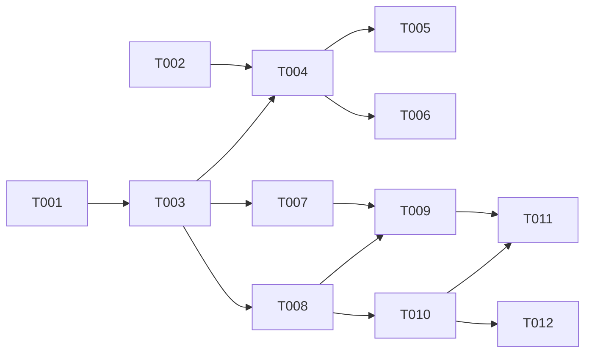

# TASKS: Launchline

## Inputs

- Features: `doc/features/01_launchline_command_center.feature`, `doc/features/02_launchline_location_workspace.feature`, `doc/features/03_launchline_exception_flow.feature`
- Architecture: `doc/features/launchline/architecture.md`

## Phase 1: Setup

- [ ] T001 Create the static Launchline route with fictional fixture data in `src/pages/demo/launchline.astro`.

## Phase 2: Foundational

- [ ] T002 Create responsive dashboard tokens, layout primitives, and reduced-motion styles in `src/styles/launchline.css`.
- [ ] T003 Add selected-location state, derived readiness selectors, and fictional frontend-only product chrome in `src/pages/demo/launchline.astro`.

## Phase 3: Scenarios

### Scenario SC1 — Normal: Find a launch that needs attention

- [ ] T004 [SC1] Render readiness metrics, saved views, location rows, and selected-location navigation in `src/pages/demo/launchline.astro`.

#### Parallel execution examples (SC1)

None; this builds on shared portfolio state from T003.

### Scenario SC2 — Edge: Handle a view with no matching launches

- [ ] T005 [SC2] Add region and opening-month filters with a clearable no-results state in `src/pages/demo/launchline.astro`.

#### Parallel execution examples (SC2)

None; this extends the portfolio rendered in T004.

### Scenario SC3 — Error: Preserve the current location when a filter changes

- [ ] T006 [SC3] Show out-of-view selected-location context and a return-to-portfolio action in `src/pages/demo/launchline.astro`.

#### Parallel execution examples (SC3)

None; this extends the selection behavior in T004.

### Scenario SC4 — Normal: Reassign a blocked launch task

- [ ] T007 [SC4] Add plan, team, role-inbox, and activity views that synchronize a task reassignment in `src/pages/demo/launchline.astro`.

#### Parallel execution examples (SC4)

T007 can proceed with T008 after T003 because they own separate workspace views.

### Scenario SC5 — Edge: Reveal a schedule conflict

- [ ] T008 [SC5] Add schedule and dependency views with deterministic conflict and impact indicators in `src/pages/demo/launchline.astro`.

#### Parallel execution examples (SC5)

T008 can proceed with T007 after T003 because they own separate workspace views.

### Scenario SC6 — Error: Prevent an incomplete opening approval

- [ ] T009 [SC6] Add an approval sheet that blocks unresolved work and explains available decision paths in `src/pages/demo/launchline.astro`.

#### Parallel execution examples (SC6)

None; approval state depends on the plan and dependency views from T007 and T008.

### Scenario SC7 — Normal: Resolve a delayed delivery

- [ ] T010 [SC7] Add the exception dialog, impact preview, mitigation assignment, and resolve update in `src/pages/demo/launchline.astro`.

#### Parallel execution examples (SC7)

None; exception resolution uses the dependency state from T008.

### Scenario SC8 — Edge: Accept a managed risk

- [ ] T011 [SC8] Add conditional approval, visible risk condition, and approval activity record in `src/pages/demo/launchline.astro`.

#### Parallel execution examples (SC8)

None; this uses the approval and exception models from T009 and T010.

### Scenario SC9 — Error: Require a complete exception decision

- [ ] T012 [SC9] Validate required exception fields and prevent state updates until the decision is complete in `src/pages/demo/launchline.astro`.

#### Parallel execution examples (SC9)

None; this extends the exception dialog from T010.

## Dependencies

1. T001-T003 establish the route and shared local state.
2. T004-T006 complete the command center.
3. T007-T009 build the connected location workspace.
4. T010-T012 complete exception handling and decision state.

## Implementation strategy

Build one selected-location state model first, then verify each interaction updates every visible view before moving to the next scenario. Add the guided tour and portfolio link only after SC1-SC9 work consistently.

## Polish & cross-cutting concerns

- [ ] T013 Add a dismissible guided scenario that filters, scrolls, highlights, and waits for user actions in `src/pages/demo/launchline.astro`.
- [ ] T014 Link the portfolio to Launchline after the demo is complete in `src/pages/index.astro`.
- [ ] T015 Verify dialog focus, text overflow, 375px/768px/desktop layouts, and `npm run build`.

## Validation report

Feature coverage: SC1-SC9, one task each. Total: 15 tasks. Validate with the SDD task validator before implementation.
