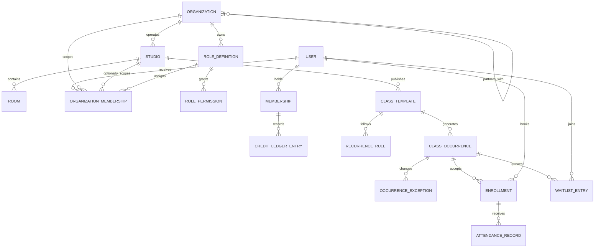

# Set Data Model

This is the proposed production data model for the fictional Set demo. Names are illustrative, but the boundaries and constraints are intentional.

## Relationship map

```text
platform_organization -> partner_organizations -> studios -> rooms
       |                      |                    
       |                      \-> role_definitions -> permission_grants
       |                      \-> organization_memberships -> users
       |                                                   \-> instructors
       |
       -> memberships -> credit_ledger_entries
      |
class_templates -> recurrence_rules -> class_occurrences
      |                                  |        \
      |                                  |         -> occurrence_exceptions
      |                                  -> enrollments -> attendance_records
      |                                  -> waitlist_entries
      |
      -> policy_versions
```

## High-level data diagram

This is a domain map, not a database dump. It shows the records that must stay in agreement when a member books, changes, or attends a class.



The important distinction is that a `CLASS_TEMPLATE` describes a reusable offering while `CLASS_OCCURRENCE` is a dated, bookable seat. A member's credit movement and enrollment are related but separate records, so they can be audited and retried safely.

## Identity and tenancy

| Table | Selected fields | Notes |
| --- | --- | --- |
| `organizations` | `id`, `parent_organization_id?`, `kind`, `name`, `default_timezone`, `status` | Tenant boundary. `kind` is `platform` or `partner`; a platform may operate or contract with multiple partner organizations. |
| `studios` | `id`, `organization_id`, `name`, `timezone`, `address`, `status` | A bookable location owned by one partner organization, with its own local timezone. |
| `users` | `id`, `email`, `display_name`, `status`, `created_at` | One individual authentication identity. No role is implied by a UI route, and no gym uses a shared account. |
| `role_definitions` | `id`, `organization_id`, `name`, `description`, `kind`, `is_system`, `created_by_id` | Roles are defined within an organization. A partner admin can start from `Partner Admin`, `Trainer`, and `Front Desk` templates and tailor the allowed actions for that partner. Platform admins manage separate Set-platform roles. |
| `permissions` | `key`, `resource`, `action`, `scope_type` | Canonical action catalog, for example `staff.assign_role`, `roles.manage`, `occurrences.edit`, `roster.view`, `members.support`, `credits.adjust`. |
| `role_permissions` | `role_id`, `permission_key`, `scope` | The explicit allow-list for a role. Scope may be organization-wide or one studio. No implicit UI-route permissions. |
| `organization_memberships` | `user_id`, `organization_id`, `studio_id?`, `role_id`, `status`, `created_at` | A person can hold multiple scoped assignments. A partner admin assigns only roles owned by their partner organization; a Set admin assigns only roles owned by the Set platform organization. |
| `instructor_profiles` | `user_id`, `organization_id`, `bio`, `status` | Instructor identity, separate from its class assignments. |
| `rooms` | `id`, `studio_id`, `name`, `capacity`, `status` | Optional for virtual or off-site sessions. |

Consumer membership is intentionally separate from staff access. `memberships.member_id` points to a `users` record and grants access to a consumer account and credits; it does not make that person partner staff. A user may be both a Set member and a partner employee, but must choose an active organization and role context before an application route is authorized.

## Demo role contexts

| Demo view | Fictional signed-in person | Active context | Scope |
| --- | --- | --- | --- |
| Member | Alex Park | Individual Set member | Alex’s membership, bookings, credits, and account only. |
| Partner | Jordan Lee | `Partner Admin` at Form House | Form House classes, rosters, staff assignments, and Form House role definitions only. |
| Admin | Priya Shah | `Admin` at Set platform | All fictional member accounts, partner records, Set staff assignments, platform role definitions, organization records, and audit history. |

The static demo switches these contexts locally. A production system would derive the context from the authenticated user, organization membership, and a permission check on every read and write.

## Memberships and credits

| Table | Selected fields | Notes |
| --- | --- | --- |
| `membership_plans` | `id`, `organization_id`, `name`, `credit_grant`, `renewal_period`, `status` | Commercial plan definition. |
| `memberships` | `id`, `member_id`, `organization_id`, `plan_id`, `status`, `starts_at`, `renews_at`, `ends_at` | A member may have only one active membership per organization. |
| `credit_ledger_entries` | `id`, `membership_id`, `amount`, `reason`, `source_type`, `source_id`, `idempotency_key`, `created_at` | Append-only. Positive entries grant credits; negative entries spend credits. |
| `payment_references` | `id`, `membership_id`, `provider`, `external_reference`, `status` | Stores provider references only, never raw card data. |

The current credit balance is a query or materialized projection of non-expired ledger entries. Do not store a mutable `credits_remaining` field as the only financial record.

## Catalog and scheduling

| Table | Selected fields | Notes |
| --- | --- | --- |
| `class_templates` | `id`, `studio_id`, `title`, `format`, `discipline`, `duration_minutes`, `base_credit_cost`, `default_capacity`, `policy_version_id`, `status` | Reusable definition. `format` includes `group` and `one_to_one`. |
| `recurrence_rules` | `id`, `template_id`, `rrule`, `local_start_time`, `timezone`, `starts_on`, `ends_on` | Recurrence in the studio's local time. |
| `class_occurrences` | `id`, `template_id`, `studio_id`, `room_id?`, `instructor_id?`, `starts_at`, `ends_at`, `capacity`, `status`, `generated_from_rule_id?` | The only entity a member can book. |
| `occurrence_exceptions` | `id`, `occurrence_id`, `type`, `reason`, `previous_starts_at?`, `previous_ends_at?`, `actor_id` | Records move, cancellation, capacity, room, or instructor overrides. |
| `instructor_availability` | `id`, `instructor_id`, `weekday`, `local_start_time`, `local_end_time`, `effective_from`, `effective_to` | Repeating working hours. |
| `availability_exceptions` | `id`, `instructor_id`, `starts_at`, `ends_at`, `type`, `reason` | Leave, blackout, or one-off availability. |

`class_occurrences` deliberately copies a few template fields at generation time when needed for historical stability. The template is the current catalog definition; the occurrence is the commitment a member sees and books.

## Enrollment and policy history

| Table | Selected fields | Notes |
| --- | --- | --- |
| `enrollments` | `id`, `occurrence_id`, `member_id`, `status`, `booked_at`, `cancelled_at?`, `policy_snapshot`, `booking_idempotency_key` | Status: `confirmed`, `cancelled`, `completed`, `no_show`. |
| `waitlist_entries` | `id`, `occurrence_id`, `member_id`, `rank`, `status`, `joined_at`, `promoted_at?`, `eligibility_snapshot` | Status: `active`, `promoted`, `expired`, `withdrawn`, `skipped`. |
| `cancellation_requests` | `id`, `enrollment_id`, `requested_by_id`, `reason`, `policy_outcome`, `refund_ledger_entry_id?`, `resolved_at` | Captures member, manager, and support actions. |
| `policy_versions` | `id`, `organization_id`, `name`, `rules`, `effective_from`, `effective_to?` | A JSON rules payload is versioned; the evaluated version is copied to enrollment. |
| `attendance_records` | `id`, `enrollment_id`, `status`, `recorded_by_id`, `recorded_at` | Supports `attended`, `late_cancel`, `no_show`, and future post-class workflows. |

## Operations and communication

| Table | Selected fields | Notes |
| --- | --- | --- |
| `audit_events` | `id`, `organization_id`, `actor_id?`, `entity_type`, `entity_id`, `event_type`, `context`, `request_id`, `created_at` | Immutable operational history. |
| `outbox_events` | `id`, `event_type`, `payload`, `occurred_at`, `processed_at?`, `attempts` | Decouples committed domain changes from notification delivery. |
| `notification_deliveries` | `id`, `outbox_event_id`, `recipient_id`, `channel`, `status`, `sent_at?`, `failure_reason?` | Delivery history and retry state. |
| `schedule_projections` | `id`, `viewer_type`, `viewer_id`, `occurrence_id`, `state`, `updated_at` | Rebuildable member, partner, and platform-support read model. |

## Database constraints and indexes

| Rule | Database enforcement |
| --- | --- |
| A member cannot have two active enrollments for one occurrence | Partial unique index on `(occurrence_id, member_id)` where status is `confirmed` or `completed`. |
| A member cannot hold an active waitlist entry and confirmed enrollment for the same occurrence | Transactional validation plus partial unique indexes per active state. |
| A room or instructor cannot be double-booked | PostgreSQL range exclusion constraints on active occurrence time ranges, scoped by room or instructor. |
| A ledger mutation can be retried safely | Unique index on `(membership_id, idempotency_key)`. |
| Waitlist order is stable | Unique index on `(occurrence_id, rank)` and a monotonic rank allocator. |
| Tenant data stays isolated | Every tenant-owned record carries `organization_id`; services scope every query before joins and verify the active organization membership. |
| Shared staff login is impossible | A user account is unique to one person; staff permissions are granted through organization memberships, never a shared credential. |
| A partner cannot administer Set staff | Role definitions and assignments are constrained to the active organization; partner admins cannot mutate platform-owned roles or memberships. |
| Permission changes are auditable | Creating a role, changing a permission, or assigning a role writes an append-only audit event with actor, target, before, and after values. |
| Audits remain useful | Audit events are append-only and foreign keys do not cascade-delete history. |

## Transaction sketches

### Book an occurrence

1. Begin transaction and lock the occurrence row.
2. Verify the member has an active membership, enough spendable credits, no conflicting active enrollment, and an available seat.
3. Create `enrollments(status = confirmed)`.
4. Insert a negative `credit_ledger_entries` row using the client idempotency key.
5. Insert `audit_events` and `outbox_events`.
6. Commit, then update projections and deliver notifications.

### Cancel an enrollment

1. Lock enrollment and occurrence.
2. Evaluate its stored `policy_snapshot` against the request time.
3. Mark the enrollment cancelled and write `cancellation_requests`.
4. If eligible, append a compensating positive ledger entry.
5. Commit an outbox event; a worker attempts one waitlist promotion under its own transaction.

## Data retained by the frontend demo

The demo intentionally keeps only derived fixture state in the browser: selected date, local bookings, class capacity, waitlist state, profile text, and an added class. It does not create any of the records above or call any service.
